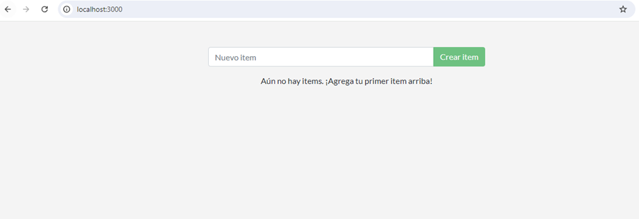
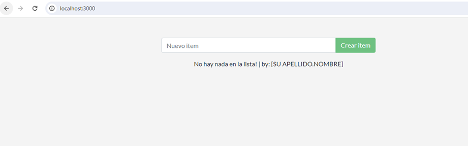
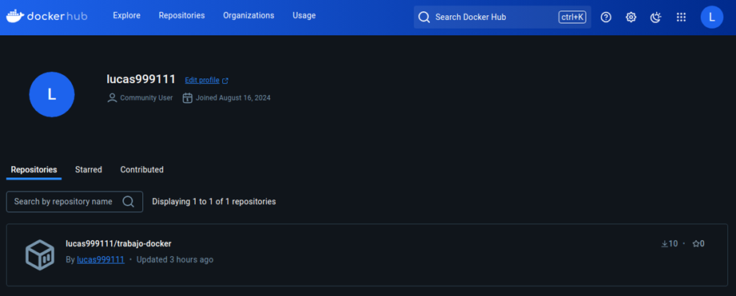
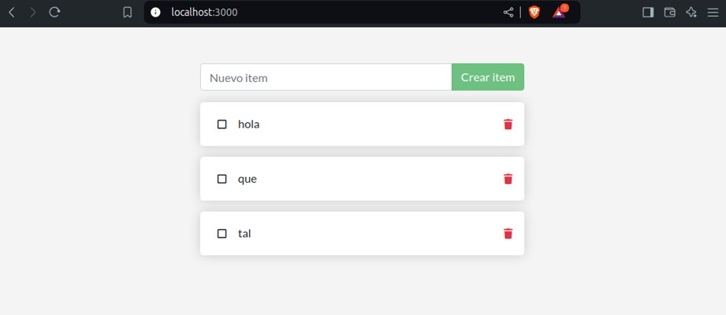
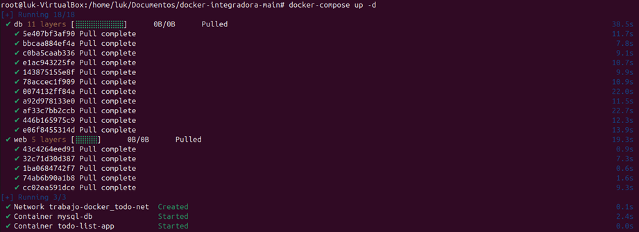
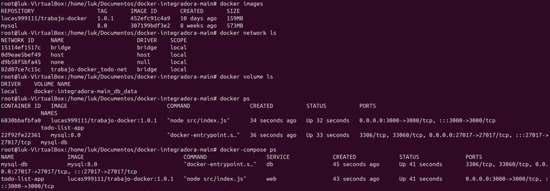
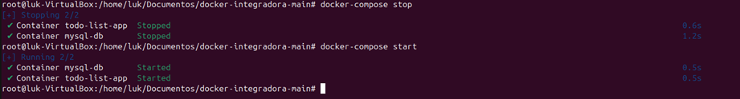
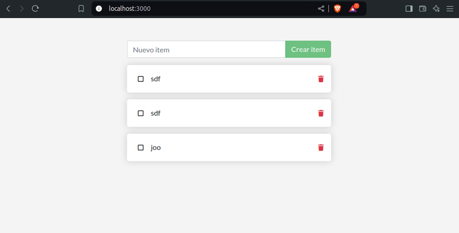

# Trabajo integrador de curso de docker

### Parte 1
Para buildear la imagen creada con el Dockerfile

``` bash
docker build -t trabajo-docker:1.0.0 .
```

Peso de la imagen
~~~
REPOSITORY     TAG     IMAGE ID      CREATED       SIZE
trabajo-docker 1.0.0   592d970f148a  5 minutes ago 159MB
~~~

Corremos el contenedor exponiendo nuestro puerto 3000 para que la app escuche en su Puerto 3000 y poder levanter la web en localHost:3000, y especificando el nombre de la imagen y el tag especifico.

``` bash
docker run -p 3000:3000 trabajo-docker:1.0.0
```
~~~
Using sqlite database at /etc/todos/todo.db
Listening on port 3000
~~~

Web corriendo en la URL: http://localhost:3000/

___


### Parte 2
Una vez hecho los cambios en el codigo de la app web volvemos a buildear la imagen

``` bash
docker build -t trabajo-docker:1.0.1 .
```
Vemos el peso de la nueva imagen
~~~
REPOSITORY     TAG    IMAGE ID      CREATED            SIZE
trabajo-docker 1.0.1  452efc91c4a9  About a minute ago 159MB
trabajo-docker 1.0.0  592d970f148a  29 minutes ago     159MB
~~~

Volvemos a correr la imagen exponiendo los puertos correspondientes y con el nuevo tag de la imagen
``` bash
docker run -p 3000:3000 trabajo-docker:1.0.1
```
~~~
Using sqlite database at /etc/todos/todo.db
Listening on port 3000
~~~

Web corriendo en la URL: http://localhost:3000/


Como ya tenemos nueva versión, borramos la vieja imagen. Imágenes actualmenta.

``` bash
docker images
```
~~~
REPOSITORY     TAG    IMAGE ID      CREATED                 SIZE
django-web     latest 6339be7c72de  Less than a second ago  80.9MB
trabajo-docker 1.0.1  452efc91c4a9  8 minutes ago           159MB
trabajo-docker 1.0.0  592d970f148a  37 minutes ago          159MB
~~~

Ejecutamos el comando para borrar imágenes y vemos que la versión 1.0.0 no está más.

``` bash
docker rmi --force 592d970f148a
```
~~~
Untagged: trabajo-docker:1.0.0
Deleted: sha256:592d970f148a9cb86dd4b73b44331375ef0499d6baeab7b6bc7c2b76c7ca50ac
~~~

``` bash
docker images
```
~~~
REPOSITORY     TAG    IMAGE ID      CREATED         SIZE
django-web     latest 6339be7c72de  11 seconds ago  80.9MB
trabajo-docker 1.0.1  452efc91c4a9  13 minutes ago  159MB
~~~
___


### Parte 3
Logeamos en dockerHub desde la terminal.
``` bash
docker login
```
~~~
Log in with your Docker ID or email address to push and pull images from Docker Hub. If you don't have a Docker ID, head over to https://hub.docker.com/ to create one.
You can log in with your password or a Personal Access Token (PAT). Using a limited-scope PAT grants better security and is required for organizations using SSO. Learn more at https://docs.docker.com/go/access-tokens/
Username: lucas999111
Password:
Login Succeeded
~~~

Armamos el tag para subir la imagen a mi perfil de usuario.

``` bash
docker image tag trabajo-docker:1.0.1 lucas999111/trabajo-docker:1.0.1
```

Con el comando push subimos la imagen especificando usuario y nombre de igamen.

``` bash
docker push lucas999111/trabajo-docker:1.0.1
```
~~~
The push refers to repository [docker.io/lucas999111/trabajo-docker]
d8ac6758ee78: Pushed
f25ae6fd607c: Pushed
27f5e0643efa: Pushed
a7b631860106: Pushed
63ca1fbb43ae: Pushed
1.0.1: digest: sha256:96b097c6287e43699935c0c3813567ed5b941d6651235ae5e9d85cf438cd2ef3 size: 1369
~~~

``` bash
docker images
```
~~~
REPOSITORY                 TAG     IMAGE ID      CREATED         SIZE
django-web                 latest  6339be7c72de  14 minutes ago  80.9MB
lucas999111/trabajo-docker 1.0.1   452efc91c4a9  27 minutes ago  159MB
trabajo-docker             1.0.1   452efc91c4a9  27 minutes ago  159MB
~~~

* Ya tenemos la imagen subida en: https://hub.docker.com/r/lucas999111/trabajo-docker
* Se puede ejecutar con: `docker run lucas999111/trabajo-docker:1.0.1`
* O se puede descargar con: `docker pull lucas999111/trabajo-docker`


___


### Parte 4
Realice una persistencia de datos con bind mount creando un directorio dentro del proyecto. Ejecute el siguiente comando:

``` bash
docker run -p 3000:3000 -v ./data:/etc/todos/ lucas999111/trabajo-docker:1.0.1
```

* Abrimos la página en http://localhost:3000/
* Agregamos contenido, paramos la ejecución del contenedor, y si volvemos a levantarlo, veremos el mismo contenido agregado anteriormente.


___


### Parte 5
Crear la red para que se conecten los contenedores. Con la red por defecto bridge.

``` bash
docker network create my-network
```

Verificamos que se creo con el siguiente comando:

``` bash
docker network ls
```
~~~
NETWORK ID    NAME       DRIVER  SCOPE
16f49ec3244b  bridge     bridge  local
0d9eae5bef49  host       host    local
02650663af84  my-network bridge  local
d9b58f5bfa45  none       null    local
~~~

* Para conectar nuestra app con una base de datos en otro contenedor tenemos que seguir los siguientes pasos.
* Crear el contenedor con la base de datos MySQL configurando las variables de entorno.

``` bash
docker run --name db -e MYSQL_ROOT_PASSWORD=root_password -e MYSQL_DATABASE=base_datos -e MYSQL_USER=usuario -e MYSQL_PASSWORD=password --network my-network -v ./data:/var/lib/mysql mysql:8.0
```
~~~
Unable to find image 'mysql:8.0' locally
8.0: Pulling from library/mysql
5e407bf3af90: Pull complete 
bbcaa884ef4a: Pull complete 
c0ba5caab336: Pull complete 
e1ac943225fe: Pull complete 
143875155e8f: Pull complete 
78accec1f909: Pull complete 
0074132ff84a: Pull complete 
a92d978133e0: Pull complete 
af33c7bb2ccb: Pull complete 
446b165975c9: Pull complete 
e06f8455314d: Pull complete 
Digest: sha256:59ffecdae8d42a45fb9429d81524273e0e237f82f8335234bc4c65dfa3588975
Status: Downloaded newer image for mysql:8.0
~~~

Tenemos la imagen creada.

``` bash
docker images
```
~~~
REPOSITORY                 TAG    IMAGE ID      CREATED      SIZE
lucas999111/trabajo-docker 1.0.1  452efc91c4a9  9 days ago   159MB
debian                     latest 4fd3f4b75df3  13 days ago  117MB
mysql                      8.0    307199bdf3e2  8 weeks ago  573MB
~~~

Crear el contenedor de la aplicación web y listo el pollo.

``` bash
docker run -p 3000:3000 -e DB_HOST=db -e DB_USER=usuario -e DB_PASSWORD=password -e DB_NAME=base_datos --network my-network lucas999111/trabajo-docker:1.0.1
```
~~~
Using sqlite database at /etc/todos/todo.db
Listening on port 3000
~~~
___


### Parte 6
Por último se puede utilizar el archivo docker-compose.yml para crear todo esto ejecutando el comando: `docker-compose up –d`
* Creara todo lo necesario


* Verificamos que se creo todo y anda con los siguientes comandos
``` bash
docker images             # vemos que creo las imagenes
docker network ls         # vemos que creo la red
docker volume ls          # vemos que se creo el volumen de la db
docker-compose ps         # verificamos que estan corriendo los contenedores
```



* Para verificar que anda con persistencia de datos, pausamos y volvemos a levantar los contenedores
``` bash
docker-compose stop         # paramos los contenedores
docker-compose start        # volvemos a levantar los contenedores
```



* Chequiamos en http://localhost:3000/


